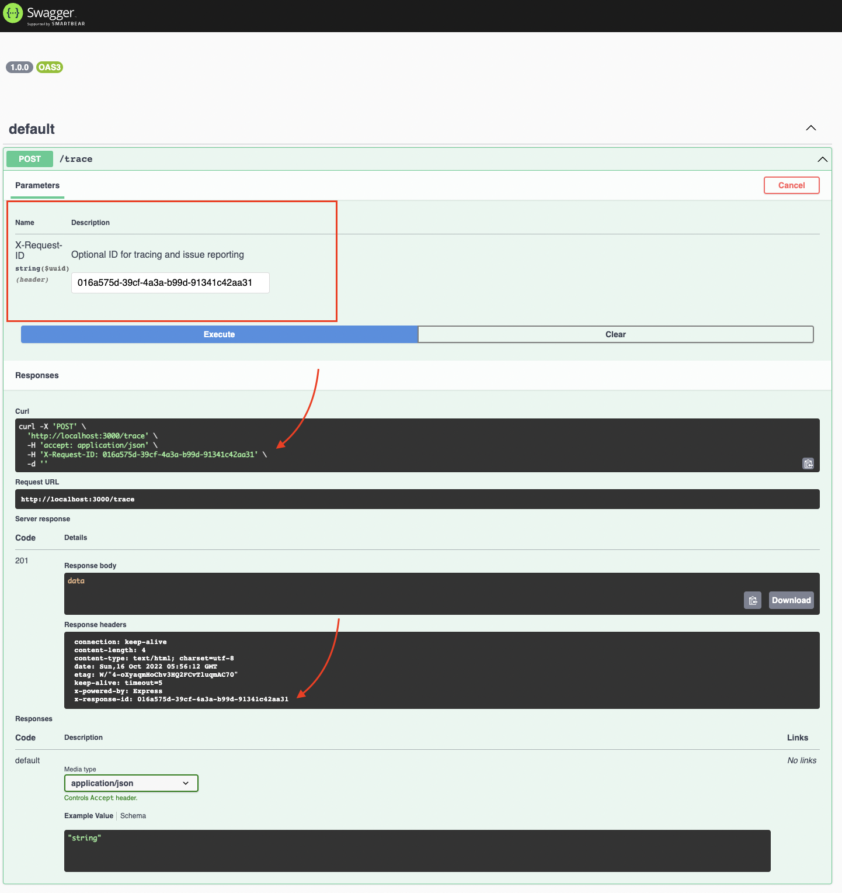

# Trace Nest.js (Express.js) Request-Response Cycle

Adds `X-Request-ID` and `X-Response-ID` headers that allow context log entries using [`gc-json-logger`](https://github.com/igrek8/gc-json-logger-nestjs).

[](https://www.npmjs.com/trace-nestjs)
[](https://coveralls.io/github/igrek8/trace-nestjs?branch=main)


## Installation

```bash
npm install --save \
  gc-json-logger \
  gc-json-logger-nestjs \
  trace-nestjs

yarn add \
  gc-json-logger \
  gc-json-logger-nestjs \
  trace-nestjs
```

## OpenAPI



## Usage

```ts
import { Controller, Module, Post } from '@nestjs/common';
import { ApiResponse } from '@nestjs/swagger';
import { Logger } from 'gc-json-logger';
import { LoggerModule, LoggerService } from 'gc-json-logger-nestjs';
import { Trace, TracingModule } from 'trace-nestjs';

@Controller()
@Trace() // 1) adds headers definition for your OpenAPI
export class AppController {
  constructor(protected readonly logger: LoggerService) {}

  @Post('/trace')
  @ApiResponse({ type: String })
  demo() {
    // 2) log something
    this.logger.info('do work');
    return 'data';
  }
}

@Module({
  imports: [
    TracingModule.register({
      // 3) specify which routes to trace
      routes: ['*'],
    }),
    LoggerModule.register({
      // 4) specify which routes to log
      routes: ['*'],
    }),
  ],
  controllers: [AppController],
})
export class AppModule {}
```

```jsonc
/* reduced logs */
{"message":"POST /","logging.googleapis.com/operation":{"id":"016a575d-39cf-4a3a-b99d-91341c42aa31"}}
{"message":"do work","logging.googleapis.com/operation":{"id":"016a575d-39cf-4a3a-b99d-91341c42aa31"}}
{"message":"201 POST /trace (4ms)","logging.googleapis.com/operation":{"id":"016a575d-39cf-4a3a-b99d-91341c42aa31"}}
```
