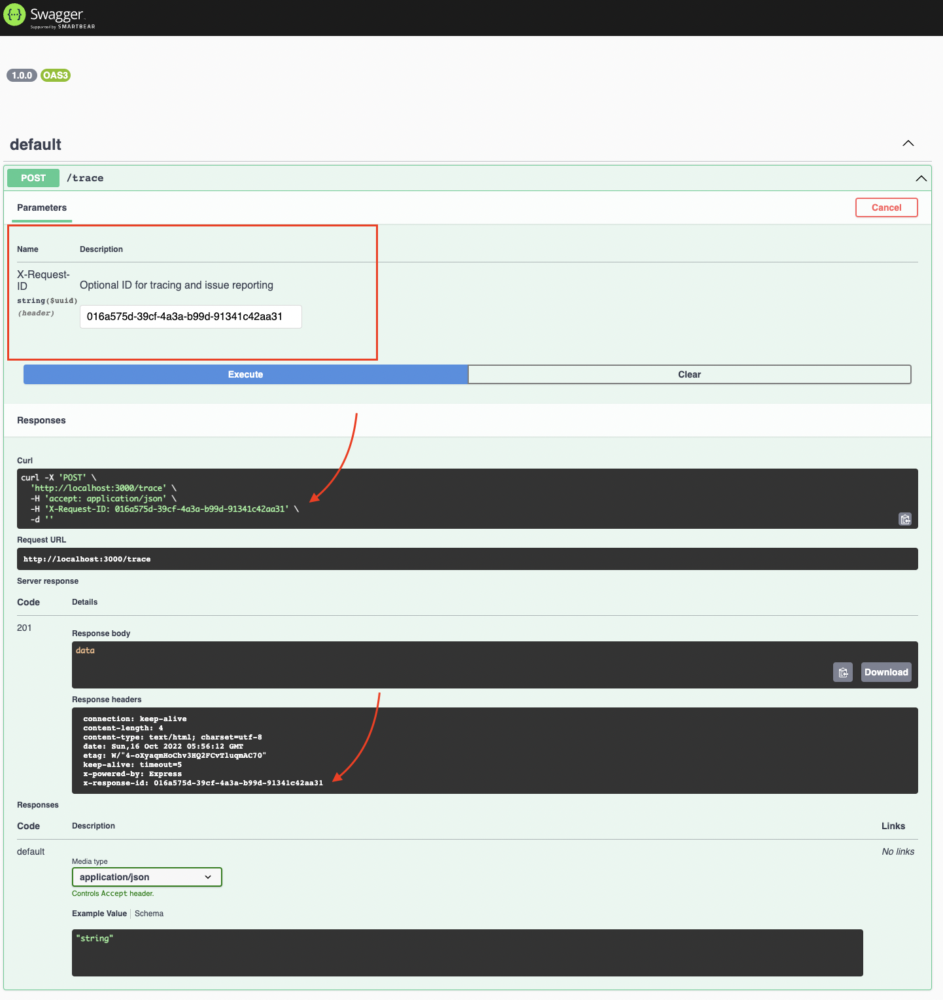

# Trace Nest.js (Express.js) Request-Response Cycle

Adds `X-Request-ID` and `X-Response-ID` headers that allow context log entries using [`gc-json-logger`](https://github.com/igrek8/gc-json-logger-nestjs).

[](https://www.npmjs.com/trace-nestjs)
[](https://codecov.io/gh/igrek8/trace-nestjs)


## Installation

```bash
npm install --save \
  gc-json-logger \
  gc-json-logger-nestjs \
  trace-nestjs

yarn add \
  gc-json-logger \
  gc-json-logger-nestjs \
  trace-nestjs
```

## OpenAPI



## Usage

[Example](./src/demo/main.ts)

```jsonc
/* reduced logs */
{"message":"POST /","logging.googleapis.com/operation":{"id":"016a575d-39cf-4a3a-b99d-91341c42aa31"}}
{"message":"do work","logging.googleapis.com/operation":{"id":"016a575d-39cf-4a3a-b99d-91341c42aa31"}}
{"message":"201 POST /trace (4ms)","logging.googleapis.com/operation":{"id":"016a575d-39cf-4a3a-b99d-91341c42aa31"}}
```
